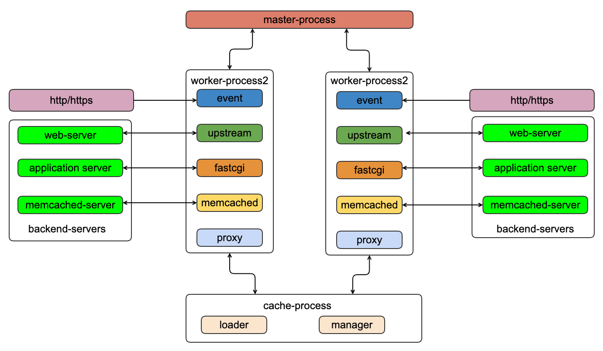

## nginx进程模型

### 整体架构



- 简单介绍
  - nginx最基本的进程有master进程和work进程，还可能会有cache相关进程。master进程和work进程之间进行通信来传递工作进程的控制信息。
  - nginx强大的模块功能，和外界服务器通信非常便捷，比如nginx的upstream和后端的Web服务器通信，依靠fastcgi与后端应用服务器通信
  
- 核心进程模型
  - nginx进程模型和大多数后台服务一样，分为管理进程和工作进程。管理进程主要是负责管理和监控工作进程，同时充当真个进程组合用户的交互接口;工作进程则是处理用户的这是请求。nginx启动后主进程充当了管理进程，而由管理进程fork出来的子进程充当了工作进程。
  - nginx多进程模型的入口是在ngx_master_process_cycle函数上，该函数做完信号处理设置后，会调用ngx_start_worker_processes函数用于fork子进程，每个子进程里面执行ngx_worker_process_cycle函数来处理请求，该函数是一个for(;;)循环，不断的处理来自客户端的请求，而主进程则继续执行gx_master_process_cycle.
  - 每个工作进程都有有一个for(;;)循环,以便进程持续等待和处理自己的负责的事务

	```
	//启动主进程的函数，该函数就是为了创建nginx的工作进程
	static void ngx_start_worker_processes(ngx_cycle_t *cycle, ngx_int_t n, ngx_int_t type)
	{
		    for (i = 0; i < n; i++) {
		
		    ngx_spawn_process(cycle, ngx_worker_process_cycle,
		                          (void *) (intptr_t) i, "worker process", type);
		}
	}
	//fork的封装函数，用户fork进程和在子进程中执行proc函数
	ngx_pid_t ngx_spawn_process(ngx_cycle_t *cycle, ngx_spawn_proc_pt proc, void *data,char *name, ngx_int_t respawn)
	{
		ngx_pid_t  pid;
		pid = fork();
		switch (pid) {
		case 0:
		    ngx_parent = ngx_pid;
		    ngx_pid = ngx_getpid();
		    proc(cycle, data);
		    break;
		
		default:
		    break;
		}
	}
	//nginx的工作进程
	static void ngx_worker_process_cycle(ngx_cycle_t *cycle, void *data)
	{
		        //工作进程的初始化
		        ngx_worker_process_init(cycle, worker);
		        //nginx的event时间处理函数
		        ngx_process_events_and_timers(cycle)
		        {
		            (void) ngx_process_events(cycle, timer, flags);
		        }
	}
	```
- 监控管理进程(master进程)
  - 监控进程的无限for(;;)循环中的sigsuspend()函数，该函数使得监控管理进程大部分时间是在挂起等待状态，知道监控进程收到信号为止.每当接受到用户发送到master进程的信号，唤醒sigsuspend函数不阻塞，nginx_master_process_cycle根据不同信号来处理不同的行为。
  
	```
	void ngx_master_process_cycle(ngx_cycle_t *cycle)
	{
	//在进程进程里面启动工作进程
   	ngx_start_worker_processes(cycle, ccf->worker_processes, NGX_PROCESS_RESPAWN);
	//启动cache管理进程
    ngx_start_cache_manager_processes(cycle, 0);
	for ( ;; ) {
		  //会一直阻塞到这里，直到收到来自用户的信号
		  sigsuspend(&set);
		  //是否有子进程退出
		  if (ngx_reap) {
			  //对应的处理函数
			  ngx_reap_children(cycle);
		  }
		  //是否接受到nginx退出的信号
		  if (!live && (ngx_terminate || ngx_quit)) {
            ngx_master_process_exit(cycle);
        }
		//是否是nginx退出的信号
		if (ngx_terminate) {
			ngx_signal_worker_processes(cycle, SIGKILL);
		}
		//是否收到nignx优雅退出的信号
		if (ngx_quit) {
            ngx_signal_worker_processes(cycle,ngx_signal_value(NGX_SHUTDOWN_SIGNAL));
		}
		//是否收到配置文件重新加载的信号
		if (ngx_reconfigure) {
			//重新加载配置信号收到以后，重新启动新的子进程作为工作进程
			ngx_start_worker_processes(cycle, ccf->worker_processes,NGX_PROCESS_JUST_RESPAWN);
			//启动cache管理进程
            ngx_start_cache_manager_processes(cycle, 1);
			//关闭原来旧的工作进程
			ngx_signal_worker_processes(cycle,ngx_signal_value(NGX_SHUTDOWN_SIGNAL));
		}
		if (ngx_reopen) {
            ngx_signal_worker_processes(cycle,ngx_signal_value(NGX_REOPEN_SIGNAL));
        }

        if (ngx_change_binary) {
            ngx_new_binary = ngx_exec_new_binary(cycle, ngx_argv);
        }

        if (ngx_noaccept) {
            ngx_signal_worker_processes(cycle,ngx_signal_value(NGX_SHUTDOWN_SIGNAL));
        }
	}
	}
	```
- 工作进程(worker process)
  - 工作进程主要关注和客户端或者后端服务器(作为反向代理)之间的数据可读可写的IO事件交互而不是进程信号，所有的工作进程的阻塞点是在像select()/epoll_wait()这样的IO复用函数。
  
  ```
  static void ngx_worker_process_cycle(ngx_cycle_t *cycle, void *data)
	{
    	//nginx工作进程的初始化
    	ngx_worker_process_init(cycle, worker);
		//启动cache管理进程
    	ngx_setproctitle("worker process");
    	for ( ;; ) {
        	if (ngx_exiting) {
            	if (ngx_event_no_timers_left() == NGX_OK) {
                	ngx_worker_process_exit(cycle);
            	}
        	}
       	//nginx的事件和定时器的处理函数
        ngx_process_events_and_timers(cycle)
		{
			//这里调用ngx_epoll_process_events函数处理IO
			ngx_epoll_process_events()
		}
        if (ngx_terminate) {
            ngx_worker_process_exit(cycle);
        }
        if (ngx_quit) {

            if (!ngx_exiting) {
                ngx_close_listening_sockets(cycle);
                ngx_close_idle_connections(cycle);
            }
        }
        if (ngx_reopen) {
            	ngx_reopen_files(cycle, -1);
        	}
    	}
	}
  ```
  ```
	[root@CentOS1 ~]$ gdb /usr/local/nginx/sbin/nginx
	(gdb) !ps -ef|grep nginx
	root     20899     1  0 02:29 ?        00:00:00 nginx: master process /usr/local/nginx/sbin/nginx
	nobody   20900 20899  0 02:29 ?        00:00:00 nginx: worker process
	root     20939 20857  0 02:31 pts/1    00:00:00 gdb /usr/local/nginx/sbin/nginx
	root     20944 20939  0 02:31 pts/1    00:00:00 bash -c ps -ef|grep nginx
	root     20946 20944  0 02:31 pts/1    00:00:00 grep nginx
	(gdb) attach  20900
	A(gdb) br ngx_process_events_and_timers
	Breakpoint 1 at 0x43f26e: file src/event/ngx_event.c, line 199.
	(gdb) br ngx_worker_process_cycle 
	Breakpoint 2 at 0x44c29c: file src/os/unix/ngx_process_cycle.c, line 730.
	(gdb) c
	Continuing.
	//此时在另外一个窗口执行curl http://127.0.0.1/index
	Breakpoint 1, ngx_process_events_and_timers (cycle=0xde0130) at src/event/ngx_event.c:199
	199         if (ngx_timer_resolution) {
	(gdb) c
	Continuing.

	Breakpoint 1, ngx_process_events_and_timers (cycle=0xde0130) at src/event/ngx_event.c:199
	199         if (ngx_timer_resolution) {
	(gdb) n
	204             timer = ngx_event_find_timer();
	(gdb) macro expand ngx_process_events
	expands to: ngx_event_actions.process_events
	(gdb) p ngx_event_actions.process_events
	$1 = (ngx_int_t (*)(ngx_cycle_t *, ngx_msec_t, ngx_uint_t)) 0x44e497 <ngx_epoll_process_events>
  ```

  - Cache进程模型
    - 如果nnginx开启了缓存功能，比如proxy cache,那么nginx还将创建另外两个cache相关的进程，一个是cache manager process，Cache管理进程;另外一个是cache loader process,缓存加载进程;cache进程不处理客户端请求，也不监控IO事件，而处理的是超时的事件，在ngx_process_events_and_timers函数执行ngx_event_expire_timers函数。相关的配置如下
  
	```
	//nginx.conf配置
	http {
	//配置新增缓存目录
   	proxy_cache_path /tmp levels=1:2 keys_zone=one:10m;
    server {
		//忽略
        location / {
			//开启缓存
            proxy_cache one;
			//缓存有效性配置
            proxy_cache_valid 200 302 10m;
            root   html;
            index  index.html index.htm;
        }
	 }
	}
	```
	```
	//未开启cache的进程视图
	[root@CentOS1 ~]$ ps auxf |grep nginx|grep -v grep
	root     20899  0.0  0.0  20868   608 ?        Ss   02:29   0:00 nginx: master process /usr/local/nginx/sbin/nginx
	nobody   20900  0.0  0.0  21304  1640 ?        S    02:29   0:00  \_ nginx: worker process
	//修改配置，开启缓存功能，重新加载nginx
	[root@CentOS1 ~]$ /usr/local/nginx/sbin/nginx -s reload
	//查看当前的进程视图
	[root@CentOS1 ~]$ ps auxf |grep nginx|grep -v grep     
	root     20899  0.0  0.0  31244  1640 ?        Ss   02:29   0:00 nginx: master process /usr/local/nginx/sbin/nginx
	nobody   21065  0.0  0.0  31664  1244 ?        S    02:44   0:00  \_ nginx: worker process
	nobody   21066  0.0  0.0  31244  1076 ?        S    02:44   0:00  \_ nginx: cache manager process
	nobody   21067  0.0  0.0  31244  1076 ?        S    02:44   0:00  \_ nginx: cache loader process
	```