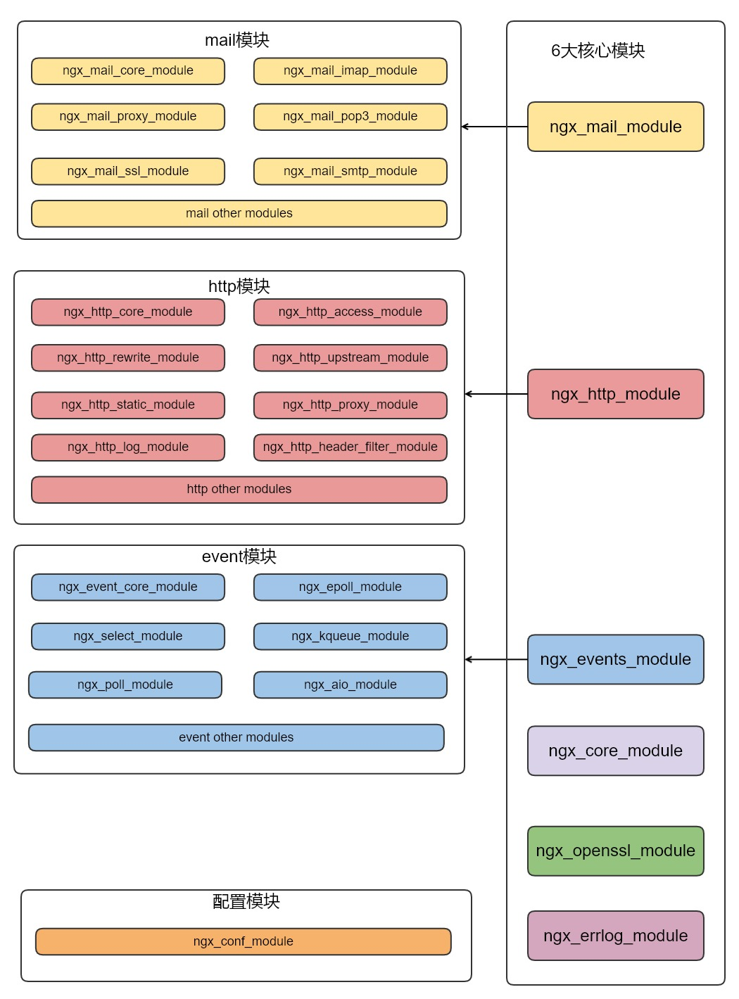

## module定义和说明


| 作者 | 时间 |QQ技术交流群 |
| ------ | ------ |------ |
| perrynzhou@gmail.com |2020/11/23 |中国开源存储技术交流群(672152841) |


### 1.调试环境

```
//1.编译nginx1.19.2
$ tar zxvf nginx-1.19.2.tar.gz
$ cd nginx-1.18.0 && CFLAGS="-ggdb3 -O0"./configure
$ make -j2 && make install

//2.安装ftp服务器
$ yum install vsftpd -y
$ systemctl start vsftpd

//3.修改配置启动nginx
nginx.conf 如下:
-------------------------------------------------
	include             /etc/nginx/mime.types;
	keepalive_timeout  65;
 	server {
        listen       80;
        server_name  localhost;
        location / {
                root  /var/ftp/pub/;
                autoindex on;
                autoindex_exact_size off;
                autoindex_localtime on;
                charset utf-8,gbk;
        }

        error_page 404 /404.html;
            location = /40x.html {
        }
   		}	
	}
------------------------------------------------------------

$ nginx -c nginx.conf
```

### 2.nginx模块结构体说明

```
typedef struct ngx_module_s          ngx_module_t;
struct ngx_module_s {
    //当前模块在同类模块中的编号
    ngx_uint_t            ctx_index;
    //单个模块在全局模块中的序号
    ngx_uint_t            index;
    //模块名称
    char                 *name;

    ngx_uint_t            spare0;
    ngx_uint_t            spare1;

    ngx_uint_t            version;
    const char           *signature;
    //当前模块的私有数据，可以表示任何的数据
    void                 *ctx;
    //当前模块配置项解析数组
    ngx_command_t        *commands;
    //模块类型
    ngx_uint_t            type;
    //初始化master进程时候被调用
    ngx_int_t           (*init_master)(ngx_log_t *log);
    //初始化module时候被调用
    ngx_int_t           (*init_module)(ngx_cycle_t *cycle);
    //初始化worker进程时候被调用
    ngx_int_t           (*init_process)(ngx_cycle_t *cycle);
    //初始化线程时候被调用
    ngx_int_t           (*init_thread)(ngx_cycle_t *cycle);
    //线程退出时候被调用，
    void                (*exit_thread)(ngx_cycle_t *cycle);
    //worker进程退出时候被调用主要体现在ngx_worker_process_exit这个函数上
    void                (*exit_process)(ngx_cycle_t *cycle);
	//master进程退出时候被调用，主要体现在ngx_master_process_exit函数里
    void                (*exit_master)(ngx_cycle_t *cycle);
};
//设置http模块的配置文件解释时候回调函数
static ngx_http_module_t  ngx_http_core_module_ctx = {
    //解析http块配置时候调用
    ngx_http_core_preconfiguration,        /* preconfiguration */
    ngx_http_core_postconfiguration,       /* postconfiguration */

    ngx_http_core_create_main_conf,        /* create main configuration */
    ngx_http_core_init_main_conf,          /* init main configuration */

    ngx_http_core_create_srv_conf,         /* create server configuration */
    ngx_http_core_merge_srv_conf,          /* merge server configuration */

    ngx_http_core_create_loc_conf,         /* create location configuration */
    ngx_http_core_merge_loc_conf           /* merge location configuration */
};

ngx_module_t  ngx_http_core_module = {
    NGX_MODULE_V1,
    &ngx_http_core_module_ctx,             /* module context */
    ngx_http_core_commands,                /* module directives */
    NGX_HTTP_MODULE,                       /* module type */
    NULL,                                  /* init master */
    NULL,                                  /* init module */
    NULL,                                  /* init process */
    NULL,                                  /* init thread */
    NULL,                                  /* exit thread */
    NULL,                                  /* exit process */
    NULL,                                  /* exit master */
    NGX_MODULE_V1_PADDING
};
```
### 3.nginx模块分类


-   nginx设计了6个核心模块，分别是ngx_core_module、ngx_events_module、ngx_openssl_module、ngx_http_module、ngx_mail_module、ngx_errlog_module。核心功能都封装在这些核心模块中
- 这6大模块只是定义了6类业务的业务流程，具体工作并不是由这些模块执行。例如event模块是由ngx_event_module定义，但是由ngx_event_core_module模块加载，http模块由ngx_http_module定义和加载，业务请求应该调用哪个http模块，则由ngx_http_core_module来处理。

### 4.http模块功能
- 该模块主要处理NGX_HTTP_CONTENT_PHASE阶段的请求，这个阶段4个回调函数分别是 ngx_http_autoindex_handler、ngx_http_dav_handler、ngx_http_gzip_static_handler、ngx_http_index_handler、ngx_http_random_index_handler、ngx_http_static_handler。
- ngx_http_static_module模块，这个核心做一个事情，当一个客户端的http静态页面请求发送到nginx服务端，nginx就能够调用到注册的ngx_http_static_handler函数。
- 我们打开一个nginx服务时候,如果直接访问是一个目录,那么nginx先是查看当前目录下是否有index.html/index.html等默认显示页面，这是回调函数ngx_http_index_handler来做的事情；如果不存在默认页面，就生成该目录下文件和目录列表，这个是ngx_http_autoindex_handler函数做的事情；根据客户端静态页面请求查找对应页面文件并生成响应，这个是ngx_http_static_handler函数做的事情


### 5. ngx_http_static_module模块定义
- 对于客户端http请求，为了获取更强的控制力，nginx将整个过程分为多个阶段，每一个阶段由0个或者多个回调函数处理。ngx_http_static_module就是将自己的模块功能函数ngx_http_static_init挂载到NGX_HTTP_CONTENT_PHASE阶段
```
static ngx_http_module_t  ngx_http_static_module_ctx = {
    NULL,                                  /* preconfiguration */
    ngx_http_static_init,                  /* postconfiguration */
	/******忽略*******/
};


ngx_module_t  ngx_http_static_module = {
    NGX_MODULE_V1,
    &ngx_http_static_module_ctx,           /* module context */
	/******忽略*******/
};
static ngx_int_t ngx_http_static_init(ngx_conf_t *cf)
{
    ngx_http_handler_pt        *h;
    ngx_http_core_main_conf_t  *cmcf;
    cmcf = ngx_http_conf_get_module_main_conf(cf, ngx_http_core_module);
     h = ngx_array_push(&cmcf->phases[NGX_HTTP_CONTENT_PHASE].handlers);
    *h = ngx_http_static_handler;

    return NGX_OK;
}

```