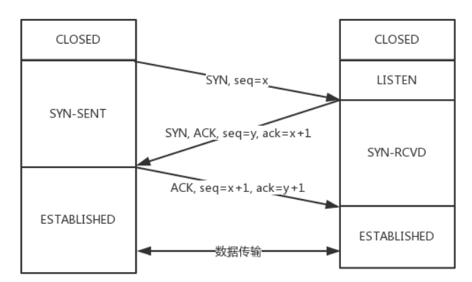
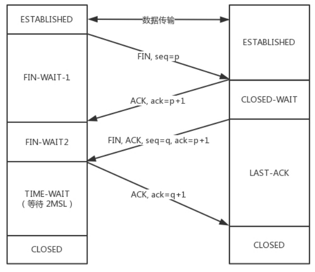
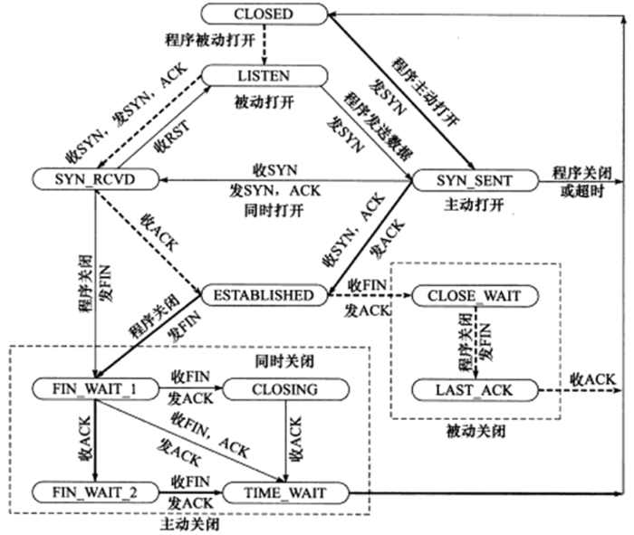
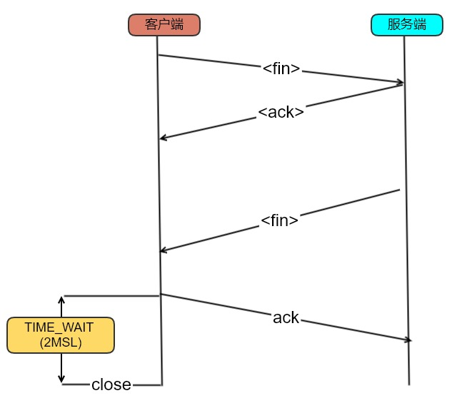

##  TCP协议中的TIME_WAIT

| 作者 | 时间 |QQ技术交流群 |
| ------ | ------ |------ |
| perrynzhou@gmail.com |2020/11/23 |中国开源存储技术交流群(672152841) |

- TCP连接、断开、状态回顾

  

  

  

- TCP中的TIME_WAIT是什么?
  - TIME_WAIT是TCP协议中断开连接中的一种状态
  
    
  - 客户端和服务端建立一条连接,客户端关闭自己这端的连接，使得TCP向服务端发送一个FIN(1)。服务端对客户端这个FIN进行ACK的确认(2)，并将客户端的FIN作为一个EOF传送给应用程序。过了一段时间服务端发送自己的FIN给客户端(3),客户端会以ACK应答服务端(4)。这时候服务端已经关闭并释放资源了，从服务端来看这个连接已经不存在了。但是客户端还没有关闭连接，而是进入TIME_WAIT状态，并在这个状态停留2MSL的两个最大段存活时间。
    
    - 2MSL是分段被丢弃之前网络中可以存活的最长时间，每个IP数据报都有一个TTL字段，数据报被路由转发一次，这个字段就减1,，当TTL字段被减到0时候，这个数据段就会被丢弃，通常这个TTL作为简单路由器跳数使用
  - 客户端等待2MSL之后，客户端也将这个连接关闭，并释放资源.
  - 关于TIME_WAIT状态需要明白如下三个点
    - 通常只有一端也就是主动关闭的一方才会进入TIME_WAIT状态
  - RFC将MSL定义为2分钟,根据这个定义，连接会在TIME_WAIT状态停留4分钟，这个值是可以进行调整的
    - 如果连接处于TIME_WAIT状态时候，有分组数据达到，就重启2MSL的定时器。
  
- 为什么需要TIME_WAIT状态？
  - 维护连接状态
    - 在TCP连接断开4个阶段中，服务端发送FIN给客户端和客户端对服务端的FIN进行ACK确认的2个阶段中，客户端对服务端FIN的ACK确认可能丢失，这个时候服务端需要重传这个FIN，直到收到last ack。
    - 如果客户端没有进入TIME_WAIT状态(使用了SO_LINGGER)而是关闭了连接，这个时候服务端在重传FIN时候，TCP就已经没有这个连接，它会以RST来响应，会给服务端产生一个错误状态，而不是有序的终止。
  - 为耗尽网络中所有这个连接的 "丢弃分段数据"提供时间
    - 如果在延迟或者重传的段在连接关闭之后达到,TCP只是将数据丢弃然后以RST进行响应。当RST发送到延迟或者重传分段的主机时候，如果这个主机没有了这个连接记录了，RST也会被丢弃。
    - TIME_WAIT状态确保了在原有连接的所有分段从网络中消失之前,不会再次使用原来用过的这对套接字(源IP、目标IP、源端口、目标端口),(以防止连接某一端机器重启了，然后启动相同端口TCP服务，原来的两端和现在的两端已经不同了，现在的两端有一端是新的连接,原来的一段发送给另一端的数据可能会发送到新的这一端)

- TIME_WAIT的劫持
  
  - 如果客户端进入TIME_WAIT状态，收到一个RST时候，客户端连接立即关闭并释放资源。
  
  - 如果客户端处于TIME_WAIT状态，并有一个原有的服务端重复分段到达,这个分段是TCP无法接受的，TCP会以一个ACK响应，说明它所期待的ACK。如果服务端已经没有这个连接了(服务端重启过),TCP会以RST来响应客户端，这个处于TIME_WAIT的客户端接受到RST会使连接立即关闭。
  
  - 在sock api中使用SO_LINGER迫使连接激励关闭，当应用程序关闭一个连接时候，及时发送缓冲区仍有数据要发送,close调用会立即返回，TCP协议栈负责和决定何时将缓冲区数据发送出去，应用程序不知道数据书否发送成功。为了防止问题，我们使用套接字选项SO_LINGER并调用setsockopt来设置这个选项
  
    ```
    struct linger {
    	// on/off选项
    	int l_onoff;
        //逗留时间
    	int l_linger;
    }
    ```
  
    - 当把成员l_onoff=0时候，linger选项是被关闭，其行为和close是一样的。如果l_onoff不为0，行为取决于l_linger的值。如果l_linger非零,这个值就作为内核将等待等待挂起的数据发送出去，并且确认时候逗留的时间。如果逗留时间到期了，仍有数据未被发送，close就返回EWOULDBLOCK,所有未发送数据都可能丢失。如果数据都发送出去了，close调用返回0
    - 如果l_linger为0 ，就将连接丢弃，就是给对方发送一个RST，不经过TIME_WAIT状态就立即关闭。