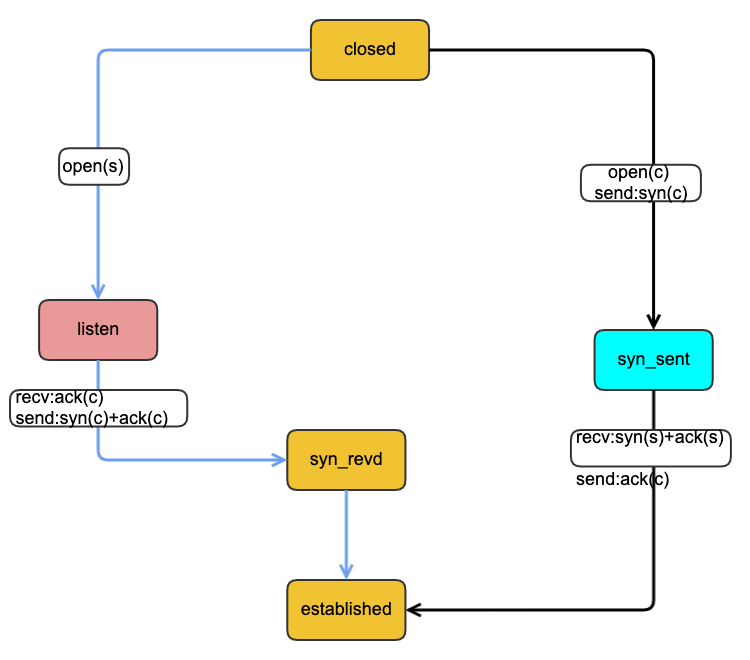
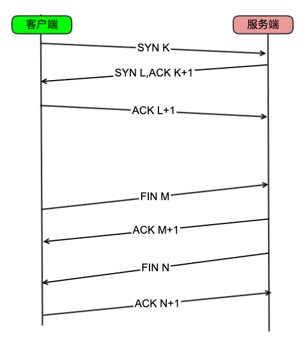

## TCP 状态转换图
| author | update |
| ------ | ------ |
| perrynzhou@gmail.com | 2020/05/24 |
- 在一个TCP连接启动与终止规则中,连接和关闭的每个节点都需要发送各种类型的报文，这些决定了TCP应该做什么的规则，其实是有TCP所属状态决定的
- TCP连接的状态图
 
	 - 服务端打开一个套接字，并监听套接字，服务端处于listen阶段
	 - 客户端打开套接字，并发送客户端的syn,客户端处于syn_sent状态
	 - 服务端接受客户端的ack,并发送自己的syn+ack,服务端处于syn_revd状态
	 - 客户端接受服务端的syn+ack,发送ack,客户端处于已连接状态
	 - 服务端接受到客户端的ack,服务端处于已连接状态，至此客户端的TCP连接成功
- TCP关闭状态图
 
 
- TCP 关闭连接时序图

 
 
 - TCP关闭连接状态说明
	 - TIME_WAIT:TIME_WAIT也称为2MSL等待状态，TCP将会等待两倍的最大段生存周期的时间，这个时间是有限制的，因为TCP报文是以IP数据报的形式传输，IP数据报拥有TTL字段和跳数限制字段，这2个字段限制了IP数据报文的有效生存时间。当TCP执行一个主动关闭并发送最终ACK时候，连接必须处于TIME_WAIT状态并持续两倍的最大生存周期。这样就能够让TCP重新发送最终ACK以避免出现丢失的情况。TIME_WAIT设计这个状态目的是允许任何受限于一条关闭连接的数据报文被丢弃
	 - TIME_WAIT_2:在FIN_WAIT_2状态，某TCP通信端已发送一个FIN并已得到另一端的确认
- 终止一个连接
	- 终止一个连接可为应用程序提供两大特性：1,任何排队的数据都将被抛弃，一个重置报文会白立即发送出去；2.重置报文的接受方会说明另外一端采用了终止的方式而不是一次正常的连接
- TCP服务器选项
	- TCP连接有2个队列，一个是连接还没有完成但是已经接受到SYN()syn队列，处于syn_revd状态）；另外一个队列是连接已经完成处于ESTABLISHED状态，但是还么有被应用程序接受(accpt队列)
	- linux中的net/ipv4.tcp_max_syn_backlog来限制 syn_revd状态的目录，如果syn队列中的超过，连接将会丢失
